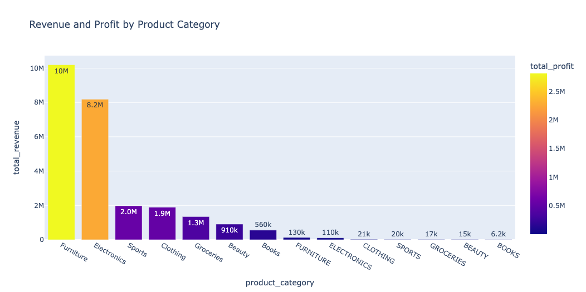

# Exploratory Data Analysis Project

[View Interactive Plot](figures/revenue_profit_by_category.html)

## Project Overview

This project presents a professional exploratory data analysis of a simulated retail sales dataset. The goal is not only to create charts, but also to answer practical business questions that a data analyst would be expected to address at a top company.

The analysis uses Python libraries including:

- Pandas
- NumPy
- Matplotlib
- Seaborn
- Plotly

The dataset contains customer orders, product categories, sales channels, regions, revenue, profit, discounts, returns, customer ratings, marketing spend, and delivery information.

---

## Dataset Summary

After cleaning, the dataset contains:

| Metric | Value |
|---|---:|
| Total Orders | 50,000 |
| Total Revenue | $25,367,498.99 |
| Total Profit | $7,019,728.63 |
| Average Order Value | $507.35 |
| Return Rate | 8.29% |
| Average Customer Rating | 3.96 |

---

## Data Cleaning Summary

The raw dataset required several cleaning steps before analysis.

Key issues identified:

- 250 duplicate rows were removed.
- Missing values were found in customer income, discount rate, payment method, customer rating, and shipping cost.
- Each affected variable had about 3% missing values.
- Product categories and sales channels had inconsistent formatting.
- The `order_date` column was converted from string to datetime.
- New time-based features were created, including year, month, month name, quarter, and day of week.
- Business features such as revenue per unit and profit per unit were created.

---

# Business Questions and Answers

## 1. What Drives Revenue?

Revenue is mainly driven by product category, unit price, quantity purchased, sales channel, and region.

The strongest numerical drivers of revenue are:

| Driver | Relationship with Revenue |
|---|---:|
| Revenue per unit | Strong positive |
| Unit price | Strong positive |
| Quantity | Moderate positive |
| Discount rate | Slight negative |

The most important revenue categories are:

| Product Category | Total Revenue | Total Profit | Average Order Value |
|---|---:|---:|---:|
| Furniture | $10,321,414.32 | $2,852,551.77 | $1,599.97 |
| Electronics | $8,293,171.81 | $2,292,914.39 | $928.89 |
| Sports | $1,993,966.56 | $552,692.17 | $328.93 |
| Clothing | $1,912,237.71 | $532,249.52 | $225.95 |
| Groceries | $1,359,364.77 | $378,979.23 | $137.42 |

### Key Revenue Insight

Furniture and Electronics are the main revenue engines. Together, they account for the largest share of total sales because they have much higher average order values than other categories.

---

## 2. What Drives Profit?

Profit is strongly connected to sales amount, profit per unit, unit price, and product category.

The most profitable categories are:

| Product Category | Total Profit | Total Revenue | Profit Margin |
|---|---:|---:|---:|
| Furniture | $2,852,551.77 | $10,321,414.32 | 27.64% |
| Electronics | $2,292,914.39 | $8,293,171.81 | 27.65% |
| Sports | $552,692.17 | $1,993,966.56 | 27.72% |
| Clothing | $532,249.52 | $1,912,237.71 | 27.83% |
| Groceries | $378,979.23 | $1,359,364.77 | 27.88% |

### Key Profit Insight

Furniture and Electronics generate the most total profit because they dominate total revenue. However, their profit margins are not dramatically higher than other categories. This means the company’s profit depends heavily on sales volume and order value, not just margin.

---

## 3. Which Customers Are Most Valuable?

The most valuable customers are those with the highest total spending.

| Customer ID | Total Spent | Total Orders | Average Order Value | Total Profit |
|---:|---:|---:|---:|---:|
| 118622 | $35,626.44 | 3 | $11,875.48 | $15,126.79 |
| 114839 | $32,942.03 | 2 | $16,471.02 | $3,888.17 |
| 118350 | $30,009.30 | 3 | $10,003.10 | $10,783.11 |
| 105278 | $29,820.65 | 2 | $14,910.32 | $3,355.27 |
| 102468 | $28,160.92 | 4 | $7,040.23 | $11,767.88 |

### Key Customer Insight

The most valuable customers are high-spending customers with relatively few but very large orders. These customers should be targeted for loyalty programs, premium offers, and retention campaigns.

---

## 4. Which Products Have High Sales but Weak Margins?

The overall profit margin is about 27.67%. Most categories have similar margins, but a few high-revenue categories have margins slightly below or close to the overall average.

| Product Category | Total Revenue | Profit Margin | Return Rate |
|---|---:|---:|---:|
| Furniture | $10,321,414.32 | 27.64% | 8.09% |
| Electronics | $8,293,171.81 | 27.65% | 8.90% |
| Beauty | $922,388.59 | 27.49% | 8.21% |

### Key Product Insight

Furniture and Electronics generate very high sales, but their margins are only around the portfolio average. Electronics also has one of the highest return rates, which may reduce net profitability after return processing costs.

---

## 5. Which Channels Produce the Best Return?

The best channel depends on whether the company cares most about total revenue, total profit, or marketing efficiency.

| Sales Channel | Total Revenue | Total Profit | Profit per Marketing Dollar |
|---|---:|---:|---:|
| Online | $9,833,344.30 | $2,736,525.60 | $2.86 |
| In Store | $7,523,611.42 | $2,078,966.36 | $2.78 |
| Mobile App | $5,537,711.26 | $1,528,296.40 | $2.77 |
| Third Party | $2,472,832.01 | $675,940.27 | $2.73 |

### Key Channel Insight

Online is the strongest overall channel. It generates the highest revenue, the highest profit, and the best profit per marketing dollar.

---

## 6. Where Are Returns Highest?

Returns are highest in the West region and among Electronics products.

### Return Rate by Region

| Region | Return Rate | Total Revenue |
|---|---:|---:|
| West | 8.87% | $4,903,829.04 |
| Northeast | 8.39% | $5,720,972.65 |
| South | 8.19% | $8,238,439.55 |
| Midwest | 7.88% | $6,504,257.75 |

### Return Rate by Product Category

| Product Category | Return Rate |
|---|---:|
| Electronics | 8.90% |
| Books | 8.49% |
| Sports | 8.26% |
| Beauty | 8.21% |
| Clothing | 8.11% |
| Furniture | 8.09% |
| Groceries | 7.99% |

### Key Return Insight

The West region has the highest regional return rate. Electronics has the highest product return rate, which should be investigated because it is also one of the company’s largest revenue categories.

---

## 7. Are Discounts Helping or Hurting Profit?

Discounts appear to hurt profit.

| Discount Group | Average Profit | Average Sales | Return Rate |
|---|---:|---:|---:|
| 0 to 5% | $157.20 | $568.91 | 6.49% |
| 5 to 10% | $148.06 | $544.12 | 7.59% |
| 10 to 20% | $141.01 | $500.96 | 8.36% |
| 20 to 40% | $120.48 | $439.07 | 10.16% |
| 40%+ | $91.78 | $328.89 | 12.96% |

### Key Discount Insight

Higher discounts are associated with lower average sales, lower average profit, and higher return rates. This suggests that discounts may be attracting lower-value or more return-prone purchases rather than increasing profitable demand.

---

## 8. Are There Seasonal Patterns?

Sales are relatively stable throughout the year, but some months perform better than others.

| Month | Total Revenue | Total Profit |
|---|---:|---:|
| August | $2,289,248.79 | $635,177.97 |
| January | $2,224,858.69 | $619,906.48 |
| October | $2,209,624.60 | $617,820.50 |
| May | $2,170,396.49 | $613,890.21 |
| September | $2,150,282.70 | $594,212.21 |

### Key Seasonality Insight

August is the strongest revenue month, followed by January and October. The third quarter is the strongest quarter overall, suggesting potential seasonal demand around late summer.

---

## 9. Are There Outliers or Data Quality Issues?

Yes. The analysis identified both outliers and data quality issues.

### Data Quality Issues

- Duplicate rows were present.
- Some columns had missing values.
- Text fields had inconsistent formatting.
- Product categories appeared in different cases before cleaning.
- Sales channels had spacing inconsistencies before cleaning.

### Outliers

The sales amount variable contains many outliers. Using the IQR method, about 5,578 observations were flagged as sales amount outliers, representing about 11.16% of the cleaned dataset.

The profit distribution is also highly skewed. Most profit values are concentrated near zero, while a small number of large positive and negative profit values stretch the distribution.

### Key Data Quality Insight

The outliers should not automatically be deleted. Some may represent legitimate high-value orders, especially in Furniture and Electronics. They should be investigated separately before modeling or reporting final business conclusions.

---

# Recommended Business Actions

## 1. Protect and Expand the Online Channel

Online is the strongest channel by revenue, profit, and marketing efficiency. The company should continue investing in online acquisition, conversion optimization, and customer retention.

## 2. Improve Electronics Return Management

Electronics is one of the largest revenue sources but also has the highest product return rate. The company should review product descriptions, warranty issues, shipping damage, customer expectations, and quality control.

## 3. Reevaluate the Discount Strategy

Higher discounts are associated with lower average profit and higher return rates. The company should reduce broad discounting and use targeted promotions focused on high-value customers and high-margin products.

## 4. Focus on High-Value Customers

A small group of customers generates very large purchases. These customers should receive loyalty incentives, early access offers, personalized recommendations, and retention campaigns.

## 5. Investigate West Region Returns

The West has the highest regional return rate. The company should examine shipping delays, product mix, customer satisfaction, and return reasons in that region.

## 6. Optimize Furniture and Electronics Margins

Furniture and Electronics drive revenue and profit, but their margins are only around the overall average. Small improvements in pricing, shipping efficiency, supplier costs, or return reduction could produce large profit gains.

## 7. Use Seasonal Planning

August, January, and October are strong sales months. The company should increase inventory planning, marketing campaigns, and staffing before these periods.

## 8. Build a Monitoring Dashboard

The company should track the following KPIs regularly:

- Total revenue
- Total profit
- Profit margin
- Average order value
- Return rate
- Revenue by product category
- Revenue by sales channel
- Profit per marketing dollar
- Discount performance
- Regional return rates
- Top customer spending

---

# Final Conclusion

This EDA shows that the business is primarily driven by high-value product categories, especially Furniture and Electronics, and by the Online sales channel. Profit is closely tied to revenue volume and unit price, while aggressive discounting appears to reduce profitability and increase returns.

The strongest business opportunities are to expand the Online channel, reduce Electronics returns, improve discount targeting, retain high-value customers, and investigate regional return patterns.
